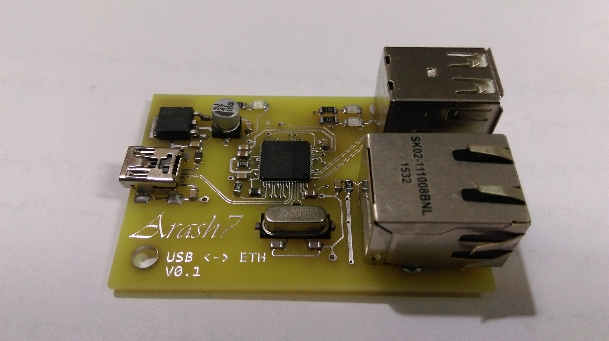

# Introduction

Inspired by Raspberry Pi 1 and how it handled USB/Ethernet connection, I'd designed my own USB to Ethernet converter based on **LAN9512** chip.

Here is it ...

# Notes

1. USB and Ethernet works fine. I'd tested `iperf` on Ethernet port.
2. `LAN9512` get a little hot. Maybe because I'd brought a fake chip. Because it didn't get that hot on my Rpi.
3. As I remember, there was a problem with power supply path, which unexpected cable disconnect in middle of board operation. I used another ferrite bead in 5v0 path and problem solved. 
4. Before any decision about this board, As good friend said: **Check it yourself** !
5. Have fun ...

